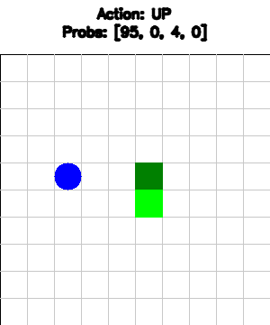
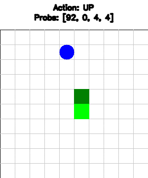
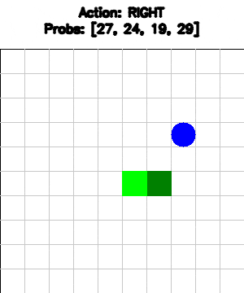

In this repo I implement several RL algorithms (DQN, DDQN, Dueling DDQN, A2C, PPO) in order to teach the agent to play snake.

Along the way, I decided to generalize my code so that it can handle any Atari game from Gymnasium, and also so that I can run multiple configurations with ease to achieve a perfect score, Thus this repo has been split to 2 repos, one for the snake, and one for the RL algorithms: https://github.com/roihezkiyahu/RLAlgorithms

The best-performing snake agent was the A2C with a mean score of 78 and a median score of 100!

Here are two of the best agent's games using A2C:

| Current AVG game A2C (Score 78) | Perfect score A2C  (Score 100)|
|:---------------------:|:-----------------:|
|  |  |

**Current Results Dueling DDQN (Score 45)**

